# Documentación detallada de las pruebas automatizadas — HAMPIQ

> **Grupo 5** · UNMSM · Pruebas funcionales end-to-end con **Selenium WebDriver + C# (NUnit)**.
> Documento que describe **cada prueba** ejecutada: objetivo, precondiciones, datos, pasos, resultado esperado, resultado obtenido y evidencia.

Se automatizaron **10 casos de prueba** de HAMPIQ (los flujos más importantes, varios con su **flujo principal** y su **flujo alterno**), dando un total de **13 pruebas**.

## Resumen de ejecución

| # | Prueba | Caso | Flujo | Resultado |
|---|--------|------|-------|-----------|
| 1 | `Login_ConCredencialesValidas_RedirigeAlDashboard` | CP-01 (CU-02) | Principal | ✅ Correcto |
| 2 | `Login_ConCredencialesInvalidas_MuestraMensajeDeError` | CP-01 (CU-02) | Alterno | ✅ Correcto |
| 3 | `GenerarToken_ConDuracionYUsos_CreaTokenConFormatoValido` | CP-02 (CU-03) | Principal | ✅ Correcto |
| 4 | `Emergencia_SimularEscaneoQr_MuestraSoloDatosVitales` | CP-03 (CU-05) | Principal | ✅ Correcto |
| 5 | `Emergencia_CodigoInvalido_MuestraErrorYNoRevelaDatos` | CP-03 (CU-05) | Alterno | ✅ Correcto |
| 6 | `Registro_ValidarDniRenec_AutocompletaDatos` | CP-04 (CU-01) | Principal | ✅ Correcto |
| 7 | `Registro_DniConFormatoInvalido_MuestraError` | CP-04 (CU-01) | Alterno | ✅ Correcto |
| 8 | `Login_Medico_RedirigeAInicioMedico` | CP-05 (CU-02) | Principal | ✅ Correcto |
| 9 | `Login_Admin_RedirigeAlPanel` | CP-06 (CU-02) | Principal | ✅ Correcto |
| 10 | `RevocarToken_DejaElTokenInvalidado` | CP-07 (CU-03) | Principal | ✅ Correcto |
| 11 | `MedicoValidaTokenDelPaciente_AccedeAlHistorial` | CP-08 (CU-04) | Principal | ✅ Correcto |
| 12 | `BuscarMedicina_MuestraComparadorDeFarmacias` | CP-09 (soporte) | Principal | ✅ Correcto |
| 13 | `Paciente_ConsultaAuditoria_VeRegistros` | CP-10 (soporte) | Principal | ✅ Correcto |

**Total: 13 pruebas · 13 correctas · 0 incorrectas.** Las pruebas se ejecutan contra HAMPIQ en marcha (frontend `http://localhost:5173`, backend `http://127.0.0.1:8000`). Cada elemento se localiza por su atributo `data-testid`.

> Además, el documento `CASOS_DE_PRUEBA_Grupo5.docx` incluye **5 casos diseñados (CP-11 a CP-15)** documentados como *pendientes de automatización*.

---

## CP-01 · Inicio de sesión (CU-02) — `Tests/LoginTests.cs`

### Prueba 1 · `Login_ConCredencialesValidas_RedirigeAlDashboard` (flujo principal)

| Campo | Detalle |
|-------|---------|
| **Caso de uso / Requisito** | CU-02 · RF-02 — Autenticación por DNI y contraseña |
| **Objetivo** | Verificar que un paciente con credenciales válidas se autentica y es dirigido a su panel. |
| **Precondiciones** | Backend (:8000) y frontend (:5173) en ejecución. Paciente semilla `45872136` / `hampiq123`. |
| **Datos de entrada** | DNI = `45872136`, Contraseña = `hampiq123` |
| **Resultado esperado** | Se carga el panel del paciente y la barra lateral muestra el nombre del usuario. |
| **Resultado obtenido** | ✅ **Correcto** — se mostró el dashboard con «Juan Carlos Pérez». |

**Pasos:**

| # | Acción | Selector (`data-testid`) |
|---|--------|--------------------------|
| 1 | Abrir HAMPIQ (landing). | — |
| 2 | Pulsar «Iniciar sesión». | `landing-login` |
| 3 | Escribir el DNI. | `login-dni` |
| 4 | Escribir la contraseña. | `login-password` |
| 5 | Pulsar «Ingresar». | `login-submit` |
| 6 | Esperar el panel y leer el nombre. | `patient-dashboard`, `sidebar-username` |

**Verificaciones:** `dashboard.EstaCargado() == true` y `ObtenerNombreUsuario()` contiene `"Juan"`.

**Evidencia:**

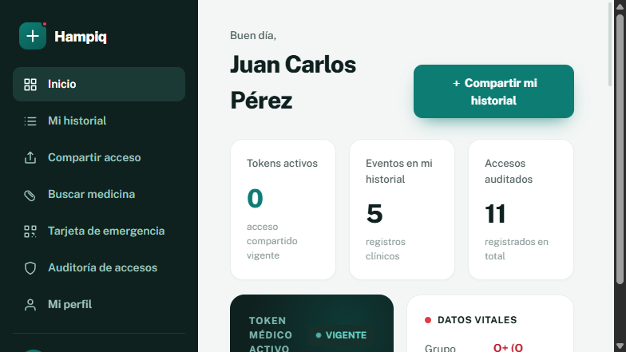

---

### Prueba 2 · `Login_ConCredencialesInvalidas_MuestraMensajeDeError` (flujo alterno)

| Campo | Detalle |
|-------|---------|
| **Caso de uso / Requisito** | CU-02 · RF-02 |
| **Objetivo** | Verificar que con credenciales inválidas el sistema muestra error y **no** autentica. |
| **Precondiciones** | Backend y frontend en ejecución. |
| **Datos de entrada** | DNI = `45872136`, Contraseña = `claveIncorrecta` |
| **Resultado esperado** | Se muestra exactamente «DNI o contraseña incorrectos.» y no se accede al panel. |
| **Resultado obtenido** | ✅ **Correcto** — apareció el mensaje de error y no hubo acceso. |

**Pasos:**

| # | Acción | Selector (`data-testid`) |
|---|--------|--------------------------|
| 1 | Abrir HAMPIQ y pulsar «Iniciar sesión». | `landing-login` |
| 2 | Escribir DNI y contraseña incorrecta. | `login-dni`, `login-password` |
| 3 | Pulsar «Ingresar». | `login-submit` |
| 4 | Leer el mensaje de error. | `login-error` |

**Verificación:** `ObtenerMensajeError() == "DNI o contraseña incorrectos."`.

**Evidencia:**

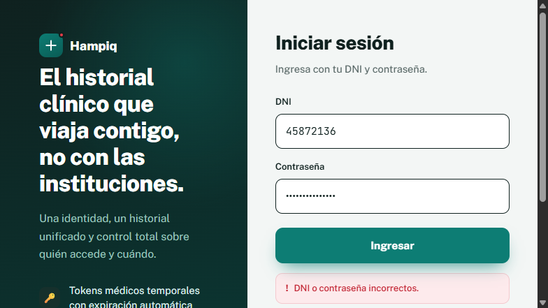

---

## CP-02 · Generación de token médico (CU-03) — `Tests/ShareTokenTests.cs`

### Prueba 3 · `GenerarToken_ConDuracionYUsos_CreaTokenConFormatoValido` (flujo principal)

| Campo | Detalle |
|-------|---------|
| **Caso de uso / Requisito** | CU-03 · RF-03 — Token de acceso temporal con TTL y usos limitados |
| **Objetivo** | Verificar que el paciente genera un token con el formato oficial y se confirma su creación. |
| **Precondiciones** | Backend y frontend en ejecución. Paciente autenticado (`45872136` / `hampiq123`). |
| **Datos de entrada** | Duración = `30 min`, Usos = `1` |
| **Resultado esperado** | Aparece el toast «Token generado…» y un código que cumple `HMPQ-XXXX-XXXX`. |
| **Resultado obtenido** | ✅ **Correcto** — p. ej. `HMPQ-RVF4-CV35`, vigencia 30:00, 1/1 usos. |

**Pasos:**

| # | Acción | Selector (`data-testid`) |
|---|--------|--------------------------|
| 1 | Iniciar sesión como paciente. | `landing-login`, `login-dni`, `login-password`, `login-submit` |
| 2 | Entrar a «Compartir acceso». | `nav-share` |
| 3 | Elegir duración 30 min. | `share-duration-30` |
| 4 | Elegir 1 uso. | `share-uses-1` |
| 5 | Pulsar «Generar token». | `share-generate` |
| 6 | Leer el toast y el código. | `toast`, `share-token-code` |

**Verificaciones:** el toast contiene `"Token generado"` y el código casa la expresión regular `^HMPQ-[A-Z0-9]{4}-[A-Z0-9]{4}$`.

**Evidencia:**

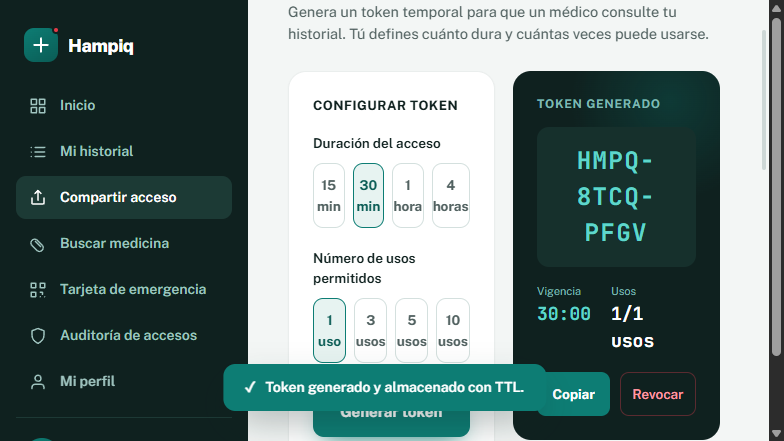

---

## CP-03 · Modo emergencia (CU-05) — `Tests/EmergencyTests.cs`

### Prueba 4 · `Emergencia_SimularEscaneoQr_MuestraSoloDatosVitales` (flujo principal)

| Campo | Detalle |
|-------|---------|
| **Caso de uso / Requisito** | CU-05 · RF-05 — Acceso de emergencia a datos vitales por QR, sin login |
| **Objetivo** | Verificar que un escaneo válido expone **solo** los datos vitales del paciente. |
| **Precondiciones** | Frontend en ejecución y **backend con `HAMPIQ_DEMO_EMERGENCY=1`** (habilita el escaneo demo). No requiere login. |
| **Datos de entrada** | — (el código lo resuelve el endpoint demo del backend) |
| **Resultado esperado** | Se muestra la tarjeta vital con grupo «O+» y alergias que incluyen «Penicilina». |
| **Resultado obtenido** | ✅ **Correcto** — tarjeta vital visible con los datos esperados. |

**Pasos:**

| # | Acción | Selector (`data-testid`) |
|---|--------|--------------------------|
| 1 | Desde la landing, pulsar «🚑 Emergencia». | `landing-emergency` |
| 2 | Pulsar «Simular escaneo de QR». | `emg-scan` |
| 3 | Esperar la tarjeta de datos vitales. | `emg-vitals` |
| 4 | Leer grupo sanguíneo y alergias. | `emg-blood-group`, `emg-allergies` |

**Verificaciones:** `EsperarDatosVitales() == true`, `ObtenerGrupoSanguineo() == "O+"`, `ObtenerAlergias()` contiene `"Penicilina"`.

> **Nota:** si el backend no se inicia con `HAMPIQ_DEMO_EMERGENCY=1`, esta prueba falla porque el botón de escaneo no puede resolver el código (es aleatorio por paciente y la pantalla es previa al login).

**Evidencia:**

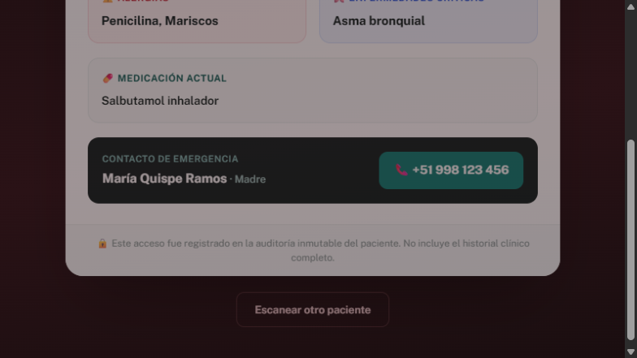

---

### Prueba 5 · `Emergencia_CodigoInvalido_MuestraErrorYNoRevelaDatos` (flujo alterno)

| Campo | Detalle |
|-------|---------|
| **Caso de uso / Requisito** | CU-05 · RF-05 |
| **Objetivo** | Verificar que un código inexistente muestra error y **no revela** ningún dato del paciente. |
| **Precondiciones** | Frontend y backend en ejecución. No requiere login. |
| **Datos de entrada** | Código = `EMG-00000000` |
| **Resultado esperado** | Mensaje «Código de emergencia inválido…» y **ausencia** de la tarjeta de datos vitales. |
| **Resultado obtenido** | ✅ **Correcto** — error mostrado y sin datos vitales. |

**Pasos:**

| # | Acción | Selector (`data-testid`) |
|---|--------|--------------------------|
| 1 | Desde la landing, pulsar «🚑 Emergencia». | `landing-emergency` |
| 2 | Escribir un código inexistente. | `emg-code` |
| 3 | Pulsar «Ver». | `emg-submit` |
| 4 | Leer el mensaje de error. | `emg-error` |
| 5 | Verificar que NO hay datos vitales. | `emg-vitals` (ausente) |

**Verificaciones:** `ObtenerMensajeError()` contiene `"inválido"` y `HayDatosVitales() == false`.

**Evidencia:**

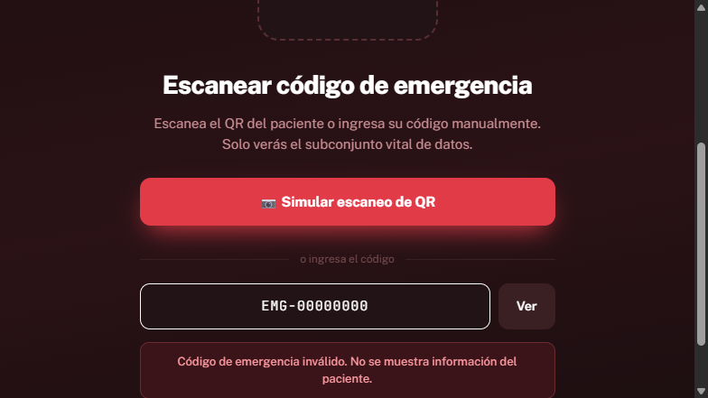

---

## CP-04 · Registro con validación RENIEC (CU-01) — `Tests/RegisterTests.cs`

### Prueba 6 · `Registro_ValidarDniRenec_AutocompletaDatos` (flujo principal)

| Campo | Detalle |
|-------|---------|
| **Objetivo** | Verificar que al validar un DNI, el sistema consulta RENIEC y autocompleta los datos oficiales. |
| **Precondiciones** | Backend y frontend en ejecución. |
| **Datos de entrada** | DNI = `08456712` |
| **Pasos** | Landing → «Crear cuenta» (`landing-register`) → escribir DNI (`reg-dni`) → «Validar» (`reg-validar`) → leer panel verificado (`reg-verified`, `reg-nombres`). |
| **Resultado esperado** | Aparece el panel «IDENTIDAD VERIFICADA» con los nombres oficiales del DNI. |
| **Resultado obtenido** | ✅ **Correcto** — se mostró «Pedro Antonio Huamán Soto». |

> Se prueba la verificación RENIEC (idempotente), no la creación de la cuenta, para que la prueba sea re-ejecutable.

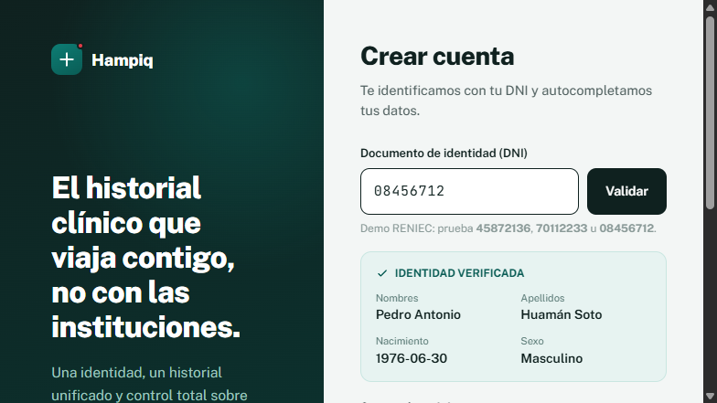

### Prueba 7 · `Registro_DniConFormatoInvalido_MuestraError` (flujo alterno)

| Campo | Detalle |
|-------|---------|
| **Objetivo** | Verificar la validación de formato del DNI antes de consultar RENIEC. |
| **Datos de entrada** | DNI = `123` |
| **Pasos** | Landing → «Crear cuenta» → escribir DNI inválido → «Validar» → leer error (`reg-error`). |
| **Resultado esperado** | Mensaje «El DNI debe tener exactamente 8 dígitos.» |
| **Resultado obtenido** | ✅ **Correcto**. |

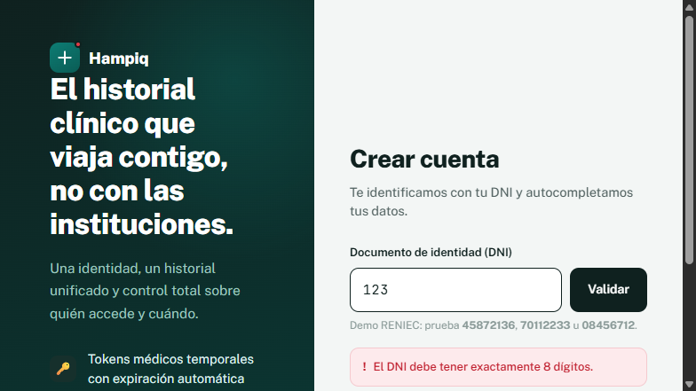

---

## CP-05 · Login de Médico (CU-02) — `Tests/LoginRolesTests.cs`

### Prueba 8 · `Login_Medico_RedirigeAInicioMedico`

| Campo | Detalle |
|-------|---------|
| **Objetivo** | Verificar que un usuario con rol médico es dirigido a su pantalla de inicio. |
| **Datos de entrada** | DNI = `40221785`, Contraseña = `medico123` |
| **Pasos** | Landing → «Iniciar sesión» → credenciales del médico → «Ingresar» → esperar `doctor-home`. |
| **Resultado esperado** | Se carga la pantalla de inicio del médico (Dra. Ana María Flores). |
| **Resultado obtenido** | ✅ **Correcto**. |

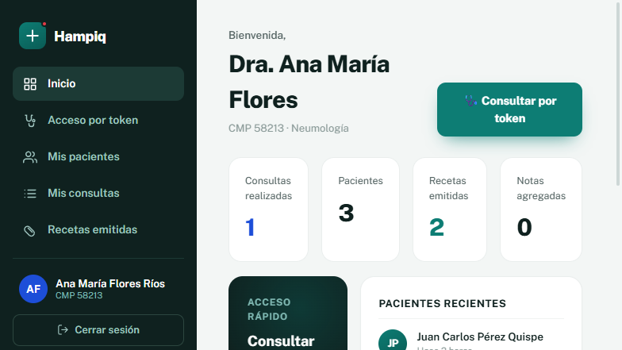

---

## CP-06 · Login de Administrador (CU-02) — `Tests/LoginRolesTests.cs`

### Prueba 9 · `Login_Admin_RedirigeAlPanel`

| Campo | Detalle |
|-------|---------|
| **Objetivo** | Verificar que un usuario con rol administrador es dirigido al panel general. |
| **Datos de entrada** | DNI = `10000001`, Contraseña = `admin123` |
| **Pasos** | Landing → «Iniciar sesión» → credenciales del admin → «Ingresar» → esperar `admin-panel`. |
| **Resultado esperado** | Se carga el «Panel general» del administrador. |
| **Resultado obtenido** | ✅ **Correcto**. |

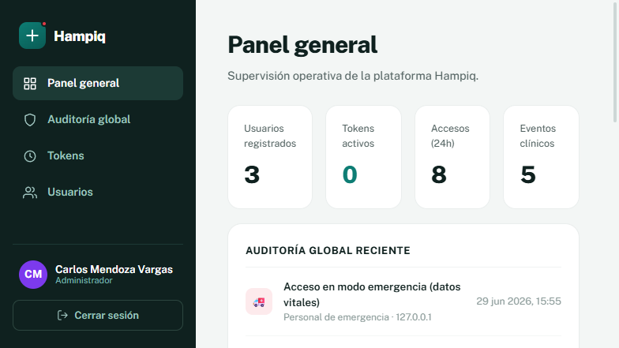

---

## CP-07 · Revocar token (CU-03) — `Tests/ShareTokenTests.cs`

### Prueba 10 · `RevocarToken_DejaElTokenInvalidado`

| Campo | Detalle |
|-------|---------|
| **Objetivo** | Verificar que el paciente puede revocar un token y el acceso queda invalidado de inmediato. |
| **Precondiciones** | Paciente autenticado (`45872136` / `hampiq123`). |
| **Pasos** | Login → «Compartir acceso» → generar token (`share-generate`) → «Revocar» (`share-revoke`) → leer toast (`toast`). |
| **Resultado esperado** | Toast «Token revocado. El acceso fue invalidado.» |
| **Resultado obtenido** | ✅ **Correcto**. |

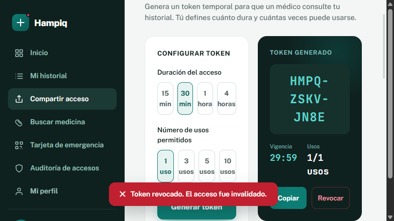

---

## CP-08 · Acceso del médico por token (CU-04) — `Tests/DoctorAccessTests.cs`

### Prueba 11 · `MedicoValidaTokenDelPaciente_AccedeAlHistorial`

| Campo | Detalle |
|-------|---------|
| **Objetivo** | Verificar el flujo entre roles: el paciente genera un token y el médico lo usa para acceder al historial. |
| **Precondiciones** | Backend y frontend en ejecución. |
| **Pasos** | (1) Paciente: login → «Compartir acceso» → generar token y copiar el código. (2) Cerrar sesión (`logout`). (3) Médico: login (`40221785/medico123`) → «Acceso por token» (`nav-doctor`) → ingresar el código (`doc-token`) → «Acceder al historial» (`doc-submit`) → esperar `doc-granted`. |
| **Resultado esperado** | Banner «Acceso autorizado al historial de Juan Carlos Pérez». |
| **Resultado obtenido** | ✅ **Correcto**. |

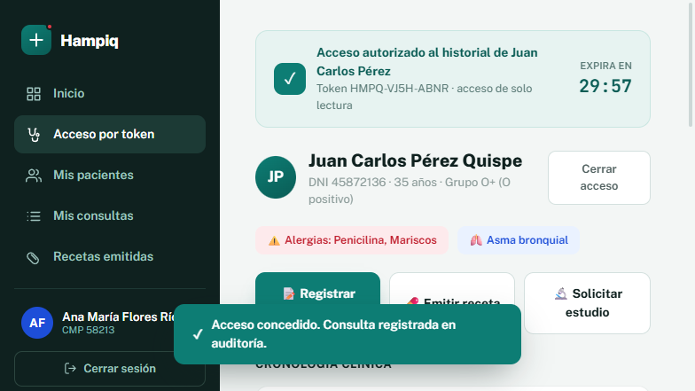

---

## CP-09 · Buscar medicina + comparador (soporte 5.3) — `Tests/MedicinesTests.cs`

### Prueba 12 · `BuscarMedicina_MuestraComparadorDeFarmacias`

| Campo | Detalle |
|-------|---------|
| **Objetivo** | Verificar que al buscar un fármaco del catálogo se muestra el comparador de precios por farmacia. |
| **Precondiciones** | Paciente autenticado. |
| **Datos de entrada** | Búsqueda = `Paracetamol` |
| **Pasos** | Login → «Buscar medicina» (`nav-medicines`) → escribir (`med-search`) → abrir resultado (`med-result-m3`) → verificar comparador (`med-comparator`) y «MÁS BARATO» (`med-cheapest`). |
| **Resultado esperado** | Se muestra el comparador ordenado por precio con la farmacia más barata marcada. |
| **Resultado obtenido** | ✅ **Correcto**. |

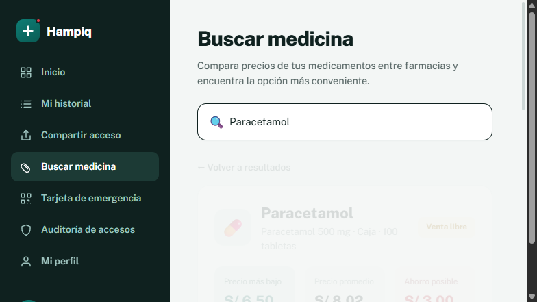

---

## CP-10 · Auditoría de accesos (soporte 5.4) — `Tests/AuditTests.cs`

### Prueba 13 · `Paciente_ConsultaAuditoria_VeRegistros`

| Campo | Detalle |
|-------|---------|
| **Objetivo** | Verificar que el paciente puede consultar su registro inmutable de accesos. |
| **Precondiciones** | Paciente autenticado. |
| **Pasos** | Login → «Auditoría de accesos» (`nav-audit`) → verificar tabla (`audit-list`) y filas (`audit-row`). |
| **Resultado esperado** | Se muestra la auditoría con al menos un registro. |
| **Resultado obtenido** | ✅ **Correcto**. |

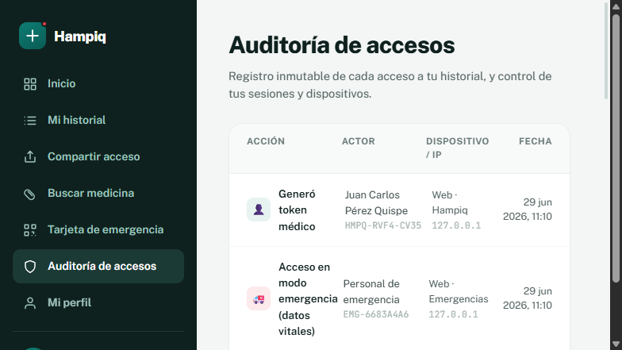

---

## Cómo se ejecutaron

1. Se levantó el **backend** (`uvicorn app.main:app --port 8000`) con `HAMPIQ_DEMO_EMERGENCY=1`.
2. Se levantó el **frontend** (`npm run dev`, puerto 5173).
3. Se ejecutó la batería desde **Visual Studio Community** (Explorador de pruebas → Ejecutar todas) o por consola con `dotnet test`.

Para el detalle de herramientas, estructura del proyecto y configuración, ver [README.md](README.md).
El documento formal de casos de prueba y evidencia está en **`CASOS_DE_PRUEBA_Grupo5.docx`**.
